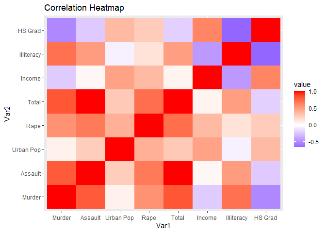
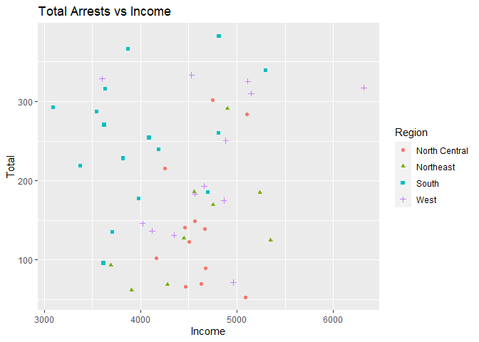
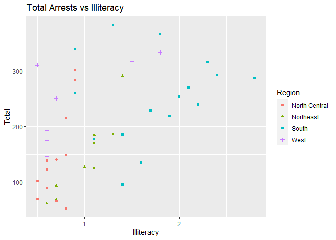
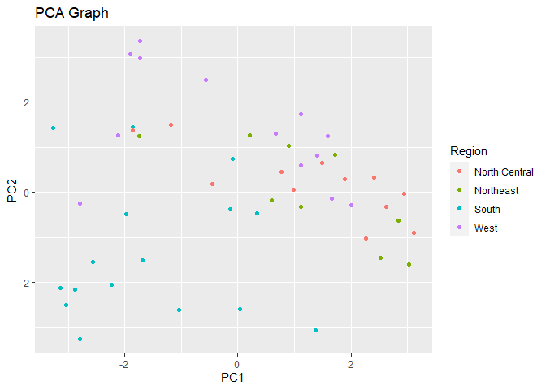

US States in the 1970's
================
Joshua Fuller

## Introduction

My project will be looking at state data from the US in the 1970's.

The data I will be using was taken from pre-installed data packages in R. The first data set is titled "USArrests". USArrests contain the amount of murders, rapes, and assaults per 100,000 per state. It also contains the percent of urban population per state. The second data set is titled "state.x77". This data set contains some variables that will be excluded during the tidying up process. However the variables of interest are the per capita income, percent of the state that is illiterate, and the percent of the state that graduated high school. The final data set I use is state.region. This contains which of the 4 regions the state is located. This will be used to identify region trends in data.

I am interested in this project because of my parents. My parents were born in 1970 so I am interested to see how the country was like when they were growing up. Prior to any tests being run, I expect to see higher crime rates in states that have higher illiteracy rates and lower percent of high school graduates.

## Tidy

``` r
# I am creating a new variable titled "Total" that contains all the arrests of rape,assault, and murder combined
USArrests <- USArrests %>% mutate(Total = Murder+Assault+Rape)
head(USArrests)
```

    ##            Murder Assault UrbanPop Rape Total
    ## Alabama      13.2     236       58 21.2 270.4
    ## Alaska       10.0     263       48 44.5 317.5
    ## Arizona       8.1     294       80 31.0 333.1
    ## Arkansas      8.8     190       50 19.5 218.3
    ## California    9.0     276       91 40.6 325.6
    ## Colorado      7.9     204       78 38.7 250.6

``` r
# I am saving the data as a data frame and am getting rid of variables in state.x77 that are not of interest 
state.x77 <- as.data.frame(state.x77)
state.x77 <- state.x77 %>% select(-1) %>% select(-3) %>% select(-3) %>% select(-4) %>% select(-4)
head(state.x77)
```

    ##            Income Illiteracy HS Grad
    ## Alabama      3624        2.1    41.3
    ## Alaska       6315        1.5    66.7
    ## Arizona      4530        1.8    58.1
    ## Arkansas     3378        1.9    39.9
    ## California   5114        1.1    62.6
    ## Colorado     4884        0.7    63.9

``` r
#I uploaded the cleaned data for USArrests and state.x77 into excel so I could name the first column variable "State"
USArrests <- read_excel("C:/Users/joshf/Desktop/Comp Bio/USArrests w state names.xlsx")
head(USArrests)
```

    ## # A tibble: 6 x 6
    ##   State      Murder Assault `Urban Pop`  Rape Total
    ##   <chr>       <dbl>   <dbl>       <dbl> <dbl> <dbl>
    ## 1 Alabama      13.2     236          58  21.2  270.
    ## 2 Alaska       10       263          48  44.5  318.
    ## 3 Arizona       8.1     294          80  31    333.
    ## 4 Arkansas      8.8     190          50  19.5  218.
    ## 5 California    9       276          91  40.6  326.
    ## 6 Colorado      7.9     204          78  38.7  251.

``` r
state.x77 <- read_excel("C:/Users/joshf/Desktop/Comp Bio/state.x77 w state names.xlsx")
head(state.x77)
```

    ## # A tibble: 6 x 4
    ##   State      Income Illiteracy `HS Grad`
    ##   <chr>       <dbl>      <dbl>     <dbl>
    ## 1 Alabama      3624        2.1      41.3
    ## 2 Alaska       6315        1.5      66.7
    ## 3 Arizona      4530        1.8      58.1
    ## 4 Arkansas     3378        1.9      39.9
    ## 5 California   5114        1.1      62.6
    ## 6 Colorado     4884        0.7      63.9

``` r
# I uploaded the data from "state.region" into excel so I could add the variable "State" to the data set
state.region <- read_excel("C:/Users/joshf/Desktop/Comp Bio/state region.xlsx")
head(state.region)
```

    ## # A tibble: 6 x 2
    ##   State      Region
    ##   <chr>      <chr> 
    ## 1 Alabama    South 
    ## 2 Alaska     West  
    ## 3 Arizona    West  
    ## 4 Arkansas   South 
    ## 5 California West  
    ## 6 Colorado   West

## Join

``` r
Project <- inner_join(USArrests,state.x77, by = "State")
Project <- inner_join(Project,state.region, by = "State")
head(Project)
```

    ## # A tibble: 6 x 10
    ##   State Murder Assault `Urban Pop`  Rape Total Income Illiteracy `HS Grad`
    ##   <chr>  <dbl>   <dbl>       <dbl> <dbl> <dbl>  <dbl>      <dbl>     <dbl>
    ## 1 Alab~   13.2     236          58  21.2  270.   3624        2.1      41.3
    ## 2 Alas~   10       263          48  44.5  318.   6315        1.5      66.7
    ## 3 Ariz~    8.1     294          80  31    333.   4530        1.8      58.1
    ## 4 Arka~    8.8     190          50  19.5  218.   3378        1.9      39.9
    ## 5 Cali~    9       276          91  40.6  326.   5114        1.1      62.6
    ## 6 Colo~    7.9     204          78  38.7  251.   4884        0.7      63.9
    ## # ... with 1 more variable: Region <chr>

I inner joined the 3 data sets because I wanted to include all the variables from all the data sets. I did it in 2 separate steps because it would be easier to find any mistakes.

## Summary Statistics

``` r
#I started off by identifying the most and least total arrests
Project %>% summarize(max(Total), min(Total))
```

    ## # A tibble: 1 x 2
    ##   `max(Total)` `min(Total)`
    ##          <dbl>        <dbl>
    ## 1         382.         53.1

The max amount of arrests was 382 per 100,000 and the least amount of arrests was 53.1 per 100,000. This leads to a spread of 328.9.

``` r
#Next I wanted to identify how many states were in each region
Project %>% group_by(Region) %>% summarize(count=n())
```

    ## # A tibble: 4 x 2
    ##   Region        count
    ## * <chr>         <int>
    ## 1 North Central    12
    ## 2 Northeast         9
    ## 3 South            16
    ## 4 West             13

The South region had sixteen states in it, while the Northeast only contained nine.

``` r
#Nex I identified which region had the highest mean total arrests per 100,00  
Project %>% group_by(Region) %>% summarize(mean(Total))
```

    ## # A tibble: 4 x 2
    ##   Region        `mean(Total)`
    ## * <chr>                 <dbl>
    ## 1 North Central          144.
    ## 2 Northeast              145.
    ## 3 South                  253.
    ## 4 West                   223.

The South region was averaging the most total arrests with 253. The North Central had the least with 144.

``` r
# I mutated the data set to add three variables that show what proportion each type of crime is to the total arrests
Project <- Project %>% mutate(Assualt_perc = Assault/Total) %>% mutate(Murder_perc = Murder/Total) %>% mutate(Rape_perc = Rape/Total)
# I grouped by region and find the mean proportion of each crime
Project %>% group_by(Region) %>% summarize(mean(Assualt_perc))
```

    ## # A tibble: 4 x 2
    ##   Region        `mean(Assualt_perc)`
    ## * <chr>                        <dbl>
    ## 1 North Central                0.826
    ## 2 Northeast                    0.863
    ## 3 South                        0.864
    ## 4 West                         0.827

``` r
Project %>% group_by(Region) %>% summarize(mean(Murder_perc))
```

    ## # A tibble: 4 x 2
    ##   Region        `mean(Murder_perc)`
    ## * <chr>                       <dbl>
    ## 1 North Central              0.0375
    ## 2 Northeast                  0.0319
    ## 3 South                      0.0481
    ## 4 West                       0.0335

``` r
Project %>% group_by(Region) %>% summarize(mean(Rape_perc)) 
```

    ## # A tibble: 4 x 2
    ##   Region        `mean(Rape_perc)`
    ## * <chr>                     <dbl>
    ## 1 North Central            0.137 
    ## 2 Northeast                0.105 
    ## 3 South                    0.0883
    ## 4 West                     0.139

| Region | Mean Arrests | Mean Perc Assault | Mean Perc Murder | Mean Perc Rape  |
|--------|--------------|-------------------|------------------|-----------------|
| NC     | 144          | 82.6%             | 3.75%            | 13.7%           |
| ------ | ------------ | ----------------- | ---------------- | --------------- |
| NE     | 145          | 86.3%             | 3.19%            | 10.5%           |
| ------ | ------------ | ----------------- | ---------------- | --------------- |
| South  | 253          | 86.4%             | 4.81%            | 8.83%           |
| ------ | ------------ | ----------------- | ---------------- | --------------- |
| West   | 223          | 82.7%             | 3.35%            | 13.9            |

I gathered all the data from the regions and put them in an easier to read table. All the regions' most common crime was assault and their least common crime was murder.

``` r
#After seeing the stats above, and being from Texas, I started to look specifically in the South region
 Project %>% filter(Region=="South") %>% select(State,Total) %>% arrange(desc(Total))
```

    ## # A tibble: 16 x 2
    ##    State          Total
    ##    <chr>          <dbl>
    ##  1 Florida         382.
    ##  2 North Carolina  366.
    ##  3 Maryland        339.
    ##  4 South Carolina  316.
    ##  5 Mississippi     292.
    ##  6 Louisiana       287.
    ##  7 Alabama         270.
    ##  8 Delaware        260.
    ##  9 Georgia         254.
    ## 10 Texas           239.
    ## 11 Tennessee       228.
    ## 12 Arkansas        218.
    ## 13 Virginia        185.
    ## 14 Oklahoma        178.
    ## 15 Kentucky        135 
    ## 16 West Virginia    96

In the Southern region, Florida had the most total arrests with 382 and West Virginia had the least with 96.

``` r
# I added Illiteracy, HS Grad, and Income to the chart above
Project %>% filter(Region=="South") %>% select(State, Total,Illiteracy,'HS Grad', Income) %>% arrange(desc(Total))
```

    ## # A tibble: 16 x 5
    ##    State          Total Illiteracy `HS Grad` Income
    ##    <chr>          <dbl>      <dbl>     <dbl>  <dbl>
    ##  1 Florida         382.        1.3      52.6   4815
    ##  2 North Carolina  366.        1.8      38.5   3875
    ##  3 Maryland        339.        0.9      52.3   5299
    ##  4 South Carolina  316.        2.3      37.8   3635
    ##  5 Mississippi     292.        2.4      41     3098
    ##  6 Louisiana       287.        2.8      42.2   3545
    ##  7 Alabama         270.        2.1      41.3   3624
    ##  8 Delaware        260.        0.9      54.6   4809
    ##  9 Georgia         254.        2        40.6   4091
    ## 10 Texas           239.        2.2      47.4   4188
    ## 11 Tennessee       228.        1.7      41.8   3821
    ## 12 Arkansas        218.        1.9      39.9   3378
    ## 13 Virginia        185.        1.4      47.8   4701
    ## 14 Oklahoma        178.        1.1      51.6   3983
    ## 15 Kentucky        135         1.6      38.5   3712
    ## 16 West Virginia    96         1.4      41.6   3617

Based on the chart, there does not seem to be a trend between arrests and any of the other three variables.

``` r
# I ran a correlation test on all of the data to see if there was any trend between Illiteracy, HS Grad, Income, and total arrests
cor.test(Project$Illiteracy, Project$Total)
```

    ## 
    ##  Pearson's product-moment correlation
    ## 
    ## data:  Project$Illiteracy and Project$Total
    ## t = 4.0489, df = 48, p-value = 0.0001867
    ## alternative hypothesis: true correlation is not equal to 0
    ## 95 percent confidence interval:
    ##  0.2631831 0.6865000
    ## sample estimates:
    ##      cor 
    ## 0.504568

``` r
cor.test(Project$`HS Grad`, Project$Total)
```

    ## 
    ##  Pearson's product-moment correlation
    ## 
    ## data:  Project$`HS Grad` and Project$Total
    ## t = -1.4343, df = 48, p-value = 0.158
    ## alternative hypothesis: true correlation is not equal to 0
    ## 95 percent confidence interval:
    ##  -0.45537789  0.08014366
    ## sample estimates:
    ##        cor 
    ## -0.2027264

``` r
cor.test(Project$Income, Project$Total)
```

    ## 
    ##  Pearson's product-moment correlation
    ## 
    ## data:  Project$Income and Project$Total
    ## t = 0.43278, df = 48, p-value = 0.6671
    ## alternative hypothesis: true correlation is not equal to 0
    ## 95 percent confidence interval:
    ##  -0.2198175  0.3348811
    ## sample estimates:
    ##        cor 
    ## 0.06234478

Income and HS Grad were both insignificant. However Illiteracy was very significant at the 99% level. If Illiteracy increases by 1 percent, the total arrests go up by 0.5.

## Visualizations

``` r
#To create a correlation heatmap, I am getting rid of all the categorical variables and the percent variable that were created in the summary statistics section
Project_corr <- Project %>% select(-State,-Region, -Assualt_perc, -Murder_perc, -Rape_perc)
```

 Based on the visual above, Total and Assault are very highly correlated. That was shown previously in the summary statistics. The most interesting finidng is that when High School graduations increases, murder and assualt both decrease.



This graph shows there is no definitive trend with income and arrests. It also shows that the South region is one of the poorest.



This graph shows that as illiteracy goes up, there is a general increase in total arrests. This graph also shows that the South and West regions have the highest illiteracy rates.

## Dimensionality Reduction

``` r
#I used Project_corr because it had only numerical variables I also scaled the data
Project_pca <- Project_corr %>% scale() %>% prcomp()
#Results from pca
names(Project_pca)
```

    ## [1] "sdev"     "rotation" "center"   "scale"    "x"

``` r
#Visualize the results
Project_pca
```

    ## Standard deviations (1, .., p=8):
    ## [1] 1.957715e+00 1.595515e+00 7.952055e-01 6.169438e-01 5.526712e-01
    ## [6] 4.718255e-01 2.839863e-01 2.391278e-16
    ## 
    ## Rotation (n x k) = (8 x 8):
    ##                    PC1         PC2           PC3         PC4        PC5
    ## Murder     -0.47998714 -0.09061736  0.0531586404 -0.03060951  0.1294222
    ## Assault    -0.47708777  0.11689857  0.1258782686 -0.09850341 -0.4179160
    ## Urban Pop  -0.10538249  0.43492286 -0.8374285006  0.22615145 -0.1718977
    ## Rape       -0.33706458  0.37820879  0.3083960464  0.33996583  0.3891920
    ## Total      -0.48201364  0.13804657  0.1457647731 -0.05524204 -0.3279227
    ## Income      0.06226518  0.53124430  0.0003241977 -0.80528209  0.2546772
    ## Illiteracy -0.36724446 -0.30173638 -0.3301455485 -0.03158356  0.6484600
    ## HS Grad     0.21493954  0.50358835  0.2338603175  0.41244447  0.1862331
    ##                    PC6          PC7           PC8
    ## Murder     -0.45341495  0.730821390 -3.468310e-02
    ## Assault     0.33848728 -0.059608612 -6.636212e-01
    ## Urban Pop  -0.13322357  0.002887279  9.367507e-17
    ## Rape       -0.37282601 -0.486444352 -7.458491e-02
    ## Total       0.24355928 -0.067907957  7.435328e-01
    ## Income     -0.01214612  0.020376790 -1.387779e-17
    ## Illiteracy  0.48892472 -0.067418940  5.551115e-17
    ## HS Grad     0.47389603  0.464906924 -2.775558e-17

``` r
#Visualize the rotated data
head(Project_pca$x)
```

    ##             PC1       PC2        PC3        PC4          PC5         PC6
    ## [1,] -2.2352227 -2.042958 -0.1360288  0.1368431  0.054521745  0.02568897
    ## [2,] -1.7358581  2.978687  2.3467717 -1.4095025  1.808206654  0.71173136
    ## [3,] -2.1221109  1.273206 -0.3135153  0.4525439 -0.018423857  1.09030780
    ## [4,] -1.0403037 -2.602951  0.1339782  0.3275297  0.014784064  0.06459381
    ## [5,] -1.9044075  3.068293 -0.1519913  0.4929486 -0.005707577  0.11156684
    ## [6,] -0.5685254  2.492185  0.5524687  0.7466125  0.170601237 -0.30674619
    ##                PC7           PC8
    ## [1,]  0.0007794874  4.766747e-16
    ## [2,] -0.1841958202  2.739717e-16
    ## [3,] -0.4163991642  7.042270e-16
    ## [4,] -0.6466390916  2.745381e-16
    ## [5,] -0.3876308900  6.118236e-16
    ## [6,] -0.2586309656 -3.450042e-17

``` r
#Save the PCA as a data frame and add region back into the data
Project_pca_data <- data.frame(Project_pca$x, Region = Project$Region)
#Plotted the data according to the new dataset
ggplot(Project_pca_data, aes(x = PC1, y = PC2, color = Region)) + geom_point()+ggtitle("PCA Graph")
```



Based on the graph above, the South region is heavily influenced by PC1 and PC2. The West is very affected by PC1 and partially affected by PC2. Finally, the Northeast and North Central region are heavily affected by PC1 but almost unaffected by PC2.

## Two Main Findings

1.  The Southern and Western United States in the 1970's were significantly more dangerous than the North Central and Northeast regions.
2.  If you want to reduce the amount of arrests, have kids learn how to read and graduate high school.
