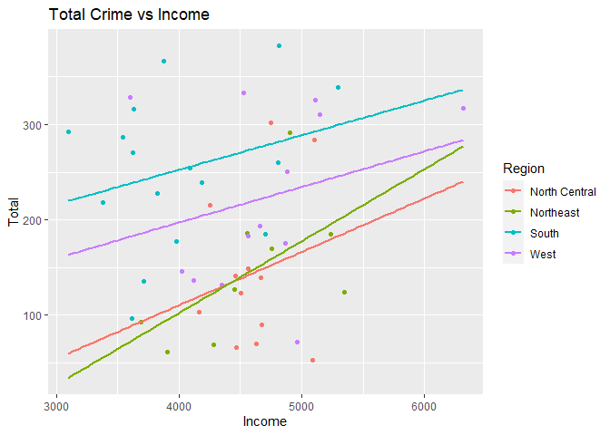
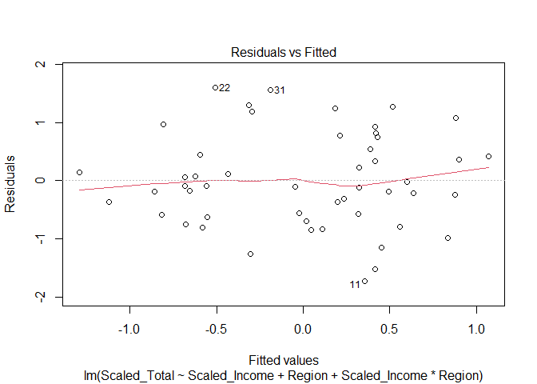
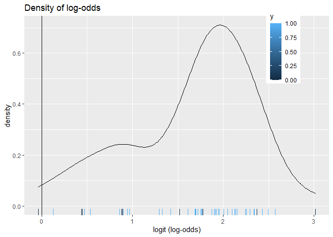
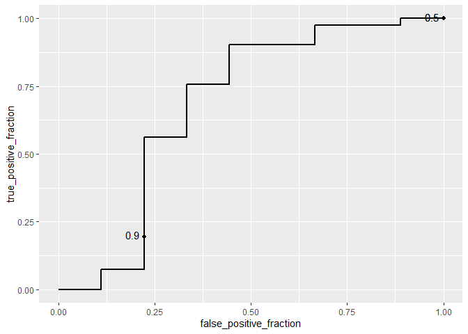

US States in the 1970's
================
Josh Fuller
April 17, 2021

## Introduction

My project will be looking at state data from the US in the 1970's.

The data I will be using was taken from pre-installed data packages in R. The first data set is titled "USArrests". USArrests contain the amount of murders, rapes, and assaults per 100,000 per state. It also contains the percent of urban population per state. The second data set is titled "state.x77". This data set contains some variables that will be excluded during the tidying up process. However the variables of interest are the per capita income, percent of the state that is illiterate, and the percent of the state that graduated high school. The final data set I use is state.region. This contains which of the 4 regions the state is located. This will be used to identify region trends in data.

For each data set there are a total of fifty observations, 1 for each state. I will be tidying the data sets by removing variables that are not relevant for my study and I will merge data sets together.

This project is a continuation of my last project. I was very interested in what I found and wanted to see if these tests would lead to any new findings. Overall I expect to find that as income increases, crime rates should decrease.

### Tidying

``` r
# I had the cleaned data from project one saved into excel and I will upload it here
USArrests_w_state_names <- read_excel("C:/Users/joshf/Desktop/Comp Bio/USArrests w state names.xlsx")
head(USArrests_w_state_names)
```

    ## # A tibble: 6 x 6
    ##   State      Murder Assault `Urban Pop`  Rape Total
    ##   <chr>       <dbl>   <dbl>       <dbl> <dbl> <dbl>
    ## 1 Alabama      13.2     236          58  21.2  270.
    ## 2 Alaska       10       263          48  44.5  318.
    ## 3 Arizona       8.1     294          80  31    333.
    ## 4 Arkansas      8.8     190          50  19.5  218.
    ## 5 California    9       276          91  40.6  326.
    ## 6 Colorado      7.9     204          78  38.7  251.

``` r
state_x77_w_state_names <- read_excel("C:/Users/joshf/Desktop/Comp Bio/state.x77 w state names.xlsx")
head(state_x77_w_state_names)
```

    ## # A tibble: 6 x 4
    ##   State      Income Illiteracy `HS Grad`
    ##   <chr>       <dbl>      <dbl>     <dbl>
    ## 1 Alabama      3624        2.1      41.3
    ## 2 Alaska       6315        1.5      66.7
    ## 3 Arizona      4530        1.8      58.1
    ## 4 Arkansas     3378        1.9      39.9
    ## 5 California   5114        1.1      62.6
    ## 6 Colorado     4884        0.7      63.9

``` r
state_region <- read_excel("C:/Users/joshf/Desktop/Comp Bio/state region.xlsx")
head(state_region)
```

    ## # A tibble: 6 x 2
    ##   State      Region
    ##   <chr>      <chr> 
    ## 1 Alabama    South 
    ## 2 Alaska     West  
    ## 3 Arizona    West  
    ## 4 Arkansas   South 
    ## 5 California West  
    ## 6 Colorado   West

### Join

``` r
#I am joining the three datasets above to create 1 data set 
Project <- inner_join(USArrests_w_state_names, state_x77_w_state_names, by = "State")
Project <- inner_join(Project, state_region, by = "State")
head(Project)
```

    ## # A tibble: 6 x 10
    ##   State Murder Assault `Urban Pop`  Rape Total Income Illiteracy `HS Grad`
    ##   <chr>  <dbl>   <dbl>       <dbl> <dbl> <dbl>  <dbl>      <dbl>     <dbl>
    ## 1 Alab~   13.2     236          58  21.2  270.   3624        2.1      41.3
    ## 2 Alas~   10       263          48  44.5  318.   6315        1.5      66.7
    ## 3 Ariz~    8.1     294          80  31    333.   4530        1.8      58.1
    ## 4 Arka~    8.8     190          50  19.5  218.   3378        1.9      39.9
    ## 5 Cali~    9       276          91  40.6  326.   5114        1.1      62.6
    ## 6 Colo~    7.9     204          78  38.7  251.   4884        0.7      63.9
    ## # ... with 1 more variable: Region <chr>

## EDA

``` r
Project %>% group_by(Region) %>% summarize(mean(Murder),mean(Rape),mean(Assault))
```

    ## # A tibble: 4 x 4
    ##   Region        `mean(Murder)` `mean(Rape)` `mean(Assault)`
    ## * <chr>                  <dbl>        <dbl>           <dbl>
    ## 1 North Central           5.7          18.4            120.
    ## 2 Northeast               4.7          13.8            127.
    ## 3 South                  11.7          21.2            220 
    ## 4 West                    7.03         29.1            187.

There are a few noticeable points right away. The South has a much larger mean in murder and the South and West have much larger means in Assault and Rape than North Central and North east.

``` r
Project %>% group_by(Region) %>% summarize(mean(Income),mean(`HS Grad`),mean(Illiteracy))
```

    ## # A tibble: 4 x 4
    ##   Region        `mean(Income)` `mean(\`HS Grad\`)` `mean(Illiteracy)`
    ## * <chr>                  <dbl>               <dbl>              <dbl>
    ## 1 North Central          4611.                54.5               0.7 
    ## 2 Northeast              4570.                54.0               1   
    ## 3 South                  4012.                44.3               1.74
    ## 4 West                   4703.                62                 1.02

The biggest standout in this data is that South has the largest illiteracy mean and West has the highest HS Grad percentage.

## MANOVA

``` r
# I ran my first MANOVA test with Murder, Assault, and Rape with Region
manova_P1 <- manova(cbind(Murder,Assault,Rape) ~ Region, data = Project)
summary(manova_P1)
```

    ##           Df  Pillai approx F num Df den Df    Pr(>F)    
    ## Region     3 0.98626   7.5097      9    138 6.731e-09 ***
    ## Residuals 46                                             
    ## ---
    ## Signif. codes:  0 '***' 0.001 '**' 0.01 '*' 0.05 '.' 0.1 ' ' 1

``` r
# MANOVA was significant so I ran ANOVA
summary.aov(manova_P1)
```

    ##  Response Murder :
    ##             Df Sum Sq Mean Sq F value    Pr(>F)    
    ## Region       3 391.24 130.412  11.144 1.282e-05 ***
    ## Residuals   46 538.32  11.703                      
    ## ---
    ## Signif. codes:  0 '***' 0.001 '**' 0.01 '*' 0.05 '.' 0.1 ' ' 1
    ## 
    ##  Response Assault :
    ##             Df Sum Sq Mean Sq F value   Pr(>F)   
    ## Region       3  90332 30110.7  5.5408 0.002478 **
    ## Residuals   46 249981  5434.4                    
    ## ---
    ## Signif. codes:  0 '***' 0.001 '**' 0.01 '*' 0.05 '.' 0.1 ' ' 1
    ## 
    ##  Response Rape :
    ##             Df Sum Sq Mean Sq F value    Pr(>F)    
    ## Region       3 1389.0  462.98  7.3192 0.0004119 ***
    ## Residuals   46 2909.8   63.26                      
    ## ---
    ## Signif. codes:  0 '***' 0.001 '**' 0.01 '*' 0.05 '.' 0.1 ' ' 1

``` r
# All were significant so I ran post-hoc on all of them
  # For Murder
pairwise.t.test(Project$Murder,Project$Region, p.adj="none")
```

    ## 
    ##  Pairwise comparisons using t tests with pooled SD 
    ## 
    ## data:  Project$Murder and Project$Region 
    ## 
    ##           North Central Northeast South  
    ## Northeast 0.51069       -         -      
    ## South     3.3e-05       1.2e-05   -      
    ## West      0.33626       0.12298   0.00065
    ## 
    ## P value adjustment method: none

``` r
  # For Assault
pairwise.t.test(Project$Assault,Project$Region, p.adj="none")
```

    ## 
    ##  Pairwise comparisons using t tests with pooled SD 
    ## 
    ## data:  Project$Assault and Project$Region 
    ## 
    ##           North Central Northeast South  
    ## Northeast 0.84638       -         -      
    ## South     0.00093       0.00391   -      
    ## West      0.02814       0.06444   0.23996
    ## 
    ## P value adjustment method: none

``` r
  # For Rape
pairwise.t.test(Project$Rape,Project$Region, p.adj="none")
```

    ## 
    ##  Pairwise comparisons using t tests with pooled SD 
    ## 
    ## data:  Project$Rape and Project$Region 
    ## 
    ##           North Central Northeast South 
    ## Northeast 0.1901        -         -     
    ## South     0.3750        0.0308    -     
    ## West      0.0017        5.8e-05   0.0108
    ## 
    ## P value adjustment method: none

For the first set of numeric variables, the MANOVA and ANOVA tests were significant. Because of this, I ran post-hoc tests for each varaible of Murder, Assaualt, and Rape where the Bonferonni alpha is 0.05. For Murder, there was a signicant difference in mean between South and North Central, South and Northeast, and South and West. For Assault, there was a significant difference in mean between South and North Central, South and Northeast, and West and North Central. Finally for Rape, there was a significant difference in mean between South and Northeast, West and North Central, West and Northeast, and West and South.

``` r
# I ran my second MANOVA Test with Income, Illiteracy, and HS Grad with Region
manova_P2 <- manova(cbind(Project$Income, Project$Illiteracy, Project$`HS Grad`) ~ Project$Region)
summary(manova_P2)
```

    ##                Df Pillai approx F num Df den Df    Pr(>F)    
    ## Project$Region  3 1.0871   8.7141      9    138 2.692e-10 ***
    ## Residuals      46                                            
    ## ---
    ## Signif. codes:  0 '***' 0.001 '**' 0.01 '*' 0.05 '.' 0.1 ' ' 1

``` r
# MANOVA was significant so I ran ANOVA
summary.aov(manova_P2)
```

    ##  Response 1 :
    ##                Df   Sum Sq Mean Sq F value   Pr(>F)   
    ## Project$Region  3  4331342 1443781   4.687 0.006136 **
    ## Residuals      46 14169750  308038                    
    ## ---
    ## Signif. codes:  0 '***' 0.001 '**' 0.01 '*' 0.05 '.' 0.1 ' ' 1
    ## 
    ##  Response 2 :
    ##                Df Sum Sq Mean Sq F value    Pr(>F)    
    ## Project$Region  3 8.3444 2.78147  12.976 2.862e-06 ***
    ## Residuals      46 9.8606 0.21436                      
    ## ---
    ## Signif. codes:  0 '***' 0.001 '**' 0.01 '*' 0.05 '.' 0.1 ' ' 1
    ## 
    ##  Response 3 :
    ##                Df  Sum Sq Mean Sq F value  Pr(>F)    
    ## Project$Region  3 2287.32  762.44  38.569 1.3e-12 ***
    ## Residuals      46  909.34   19.77                    
    ## ---
    ## Signif. codes:  0 '***' 0.001 '**' 0.01 '*' 0.05 '.' 0.1 ' ' 1

``` r
# All were significant so I ran a post-hoc on all of them
  # For Income
pairwise.t.test(Project$Income,Project$Region, p.adj="none")
```

    ## 
    ##  Pairwise comparisons using t tests with pooled SD 
    ## 
    ## data:  Project$Income and Project$Region 
    ## 
    ##           North Central Northeast South 
    ## Northeast 0.8681        -         -     
    ## South     0.0069        0.0198    -     
    ## West      0.6823        0.5849    0.0017
    ## 
    ## P value adjustment method: none

``` r
  # For Illiteracy
pairwise.t.test(Project$Illiteracy,Project$Region, p.adj="none")
```

    ## 
    ##  Pairwise comparisons using t tests with pooled SD 
    ## 
    ## data:  Project$Illiteracy and Project$Region 
    ## 
    ##           North Central Northeast South  
    ## Northeast 0.14852       -         -      
    ## South     4.6e-07       0.00039   -      
    ## West      0.08800       0.90899   0.00015
    ## 
    ## P value adjustment method: none

``` r
  # For HS Grad
pairwise.t.test(Project$'HS Grad',Project$Region, p.adj="none")
```

    ## 
    ##  Pairwise comparisons using t tests with pooled SD 
    ## 
    ## data:  Project$"HS Grad" and Project$Region 
    ## 
    ##           North Central Northeast South  
    ## Northeast 0.78033       -         -      
    ## South     3.0e-07       4.6e-06   -      
    ## West      0.00012       0.00013   5.5e-14
    ## 
    ## P value adjustment method: none

For the first set of numeric variables, the MANOVA and ANOVA tests were significant. Because of this, I ran post-hoc tests for each variable of Income, Illiteracy, and HS Grad where the Bonferroni alpha is 0.05. For Income, there was a significant difference in mean between South and North Central, South and Northeast, and South and West. For Illiteracy, there was a significant difference in mean between South and North Central, South and Northeast, and South and West. Finally for HS Grad, there was a significant difference in mean between South and North Central, South and Northeast, West and North Central, West and Northeast, and West and South.

Overall I ran 2 seperate MANOVA and ANOVA tests for the different numeric variables and tested how their means were grouped by Region. All were significant at the 0.05 level so I ran 6 post-hoc tests, 1 for each numeric variable. The assumption of independent and random samples would be met. As long with the sample size being greater than 15. Equal variance between groups would need to be tested before I could conclude it is met.

## Randomization Tests

``` r
#Create the mean_diff vector
mean_diff <- vector()
#Fill in the vector and take a random sample
for(i in 1:5000){ 
  random <- data.frame(Region = Project$Region, Crime = sample(Project$Total)) 
  
  mean_diff[i] <- random %>% 
    group_by(Region) %>%
    summarize(means = mean(Crime)) %>%
    summarize(mean_diff = diff(means)) %>%
    pull
}
#Find the true difference in means
true_diff <- Project %>%
  group_by(Region) %>%
  summarize(means = mean(Total)) %>%
  summarize(mean_diff = diff(means)) %>%
  pull
#Calculate two-sided p-value
mean(mean_diff > -true_diff | mean_diff < true_diff)
```

    ## [1] 0.8222

The null hypothesis is that there is no difference in predicted mean and true mean of total crime based on region. Based on the above code, the p-value is 0.82. This means we fail to reject the null hypothesis and the predicted mean is equal to the true mean.

## Linear Regression

``` r
# I scaled the numeric variables of Income and Total
Project$Scaled_Total <- scale(Project$Total)
Project$Scaled_Income <- scale(Project$Income)
```

``` r
# I ran a Multiple Linear Regression Model with Total, Income, and Region
fit <- lm(Scaled_Total ~ Scaled_Income + Region + Scaled_Income*Region, data = Project)
summary(fit)
```

    ## 
    ## Call:
    ## lm(formula = Scaled_Total ~ Scaled_Income + Region + Scaled_Income * 
    ##     Region, data = Project)
    ## 
    ## Residuals:
    ##     Min      1Q  Median      3Q     Max 
    ## -1.7303 -0.5844 -0.1022  0.5183  1.6052 
    ## 
    ## Coefficients:
    ##                                Estimate Std. Error t value Pr(>|t|)    
    ## (Intercept)                   -0.697548   0.300425  -2.322 0.025162 *  
    ## Scaled_Income                  0.368950   0.571927   0.645 0.522371    
    ## RegionNortheast                0.003689   0.424999   0.009 0.993116    
    ## RegionSouth                    1.431071   0.403653   3.545 0.000978 ***
    ## RegionWest                     0.842622   0.399095   2.111 0.040736 *  
    ## Scaled_Income:RegionNortheast  0.128063   0.665139   0.193 0.848251    
    ## Scaled_Income:RegionSouth     -0.129814   0.616067  -0.211 0.834129    
    ## Scaled_Income:RegionWest      -0.122569   0.617750  -0.198 0.843681    
    ## ---
    ## Signif. codes:  0 '***' 0.001 '**' 0.01 '*' 0.05 '.' 0.1 ' ' 1
    ## 
    ## Residual standard error: 0.8739 on 42 degrees of freedom
    ## Multiple R-squared:  0.3454, Adjusted R-squared:  0.2363 
    ## F-statistic: 3.166 on 7 and 42 DF,  p-value: 0.008826

Based on the regression, all variables were significant except the Northeast region, Income, and Region and Income interaction. Compared to the North Central region, being from the Northeast increased mean total crimes by 0.003. Being from the South increased mean total crimes by 1.43. Finally, being from the West increased mean total crimes by 0.84. For controlling for the region, as scaled income goes up by 1 unit, scaled total crime increases by 0.368.

    ## `geom_smooth()` using formula 'y ~ x'



``` r
#Checking for Normality
shapiro.test(fit$residuals)
```

    ## 
    ##  Shapiro-Wilk normality test
    ## 
    ## data:  fit$residuals
    ## W = 0.98081, p-value = 0.5866

``` r
#Checking for Homoscedasticity
bptest(fit)
```

    ## 
    ##  studentized Breusch-Pagan test
    ## 
    ## data:  fit
    ## BP = 8.2756, df = 7, p-value = 0.3089

``` r
#Checking for Linearity
plot(fit, which = 1)
```



All assumptions are verified.

``` r
#Regression run with Robust Standard Errors
coeftest(fit, vcov = vcovHC(fit))
```

    ## 
    ## t test of coefficients:
    ## 
    ##                                 Estimate Std. Error t value  Pr(>|t|)    
    ## (Intercept)                   -0.6975484  0.2602461 -2.6803 0.0104619 *  
    ## Scaled_Income                  0.3689497  0.9819483  0.3757 0.7090071    
    ## RegionNortheast                0.0036889  0.3387260  0.0109 0.9913624    
    ## RegionSouth                    1.4310712  0.3740311  3.8261 0.0004261 ***
    ## RegionWest                     0.8426225  0.4646841  1.8133 0.0769321 .  
    ## Scaled_Income:RegionNortheast  0.1280628  1.0276614  0.1246 0.9014223    
    ## Scaled_Income:RegionSouth     -0.1298140  1.0082591 -0.1288 0.8981695    
    ## Scaled_Income:RegionWest      -0.1225685  1.0433500 -0.1175 0.9070429    
    ## ---
    ## Signif. codes:  0 '***' 0.001 '**' 0.01 '*' 0.05 '.' 0.1 ' ' 1

Nothing changed from the initial regression run.

``` r
#Calculating Bootstrap Standard Errors
samp_SEs <- replicate(5000, { boot_data <- sample_frac(Project, replace = TRUE) 
fitboot <- lm(Scaled_Total ~ Scaled_Income, data = Project)
coef(fitboot) })
samp_SEs %>% t %>% as.data.frame %>% summarize_all(sd)
```

    ##   (Intercept) Scaled_Income
    ## 1           0             0

## Logistic Regression

``` r
#Created a binary variable for Urban Pop 
Project2 <- Project %>% mutate(y = ifelse(`Urban Pop`> 50, 1,0))
```

I know this is not from a binary categorical variable. But what this variable shows is whether or not the state has a majority of their population from Urban vs Rural locations. So it is basically a binary categorical variable.

``` r
#Creating a Logistic Regression
fit2 <- glm(y ~ Income + Illiteracy, data = Project2, family = "binomial")
summary(fit2)
```

    ## 
    ## Call:
    ## glm(formula = y ~ Income + Illiteracy, family = "binomial", data = Project2)
    ## 
    ## Deviance Residuals: 
    ##     Min       1Q   Median       3Q      Max  
    ## -2.4754   0.4285   0.5091   0.5807   1.1249  
    ## 
    ## Coefficients:
    ##               Estimate Std. Error z value Pr(>|z|)
    ## (Intercept) -1.3452323  3.9703558  -0.339    0.735
    ## Income       0.0008093  0.0007933   1.020    0.308
    ## Illiteracy  -0.4996226  0.6926234  -0.721    0.471
    ## 
    ## (Dispersion parameter for binomial family taken to be 1)
    ## 
    ##     Null deviance: 47.139  on 49  degrees of freedom
    ## Residual deviance: 43.487  on 47  degrees of freedom
    ## AIC: 49.487
    ## 
    ## Number of Fisher Scoring iterations: 4

Based on the regression model, neither income or illiteracy are significant variables in determining if the majority of the state's population lives in urban settings. However, when income increases by 1 dollar, the probability of the majority living in urban settings goes up by .08 percent. Then for Illiteracy, if it increases by 1 percent for the state, the probability of the majority living in urban settings decreases by 49.96 percent.

``` r
# Confusion Matrix
Project2$prob1 <- predict(fit2, type = "response")
Project2$predicted <- ifelse(Project2$prob1 > .5, 1, 0)
# Compare true to predicted
table(true_condition = Project2$y, predicted_condition = Project2$predicted) %>% addmargins
```

    ##               predicted_condition
    ## true_condition  0  1 Sum
    ##            0    1  8   9
    ##            1    0 41  41
    ##            Sum  1 49  50

``` r
# Sensitivity (true positive rate)
41/41
```

    ## [1] 1

``` r
# Specificity (true negative rate)
1/9
```

    ## [1] 0.1111111

``` r
# Accuracy (true positive+true negative/total pop)
42/50
```

    ## [1] 0.84

``` r
# Recall (positive predicted value)
41/49
```

    ## [1] 0.8367347

The Accuracy, Sensitivity, Specificity, and Recall are all calculated and displayed above.





``` r
#Calculate AUC
calc_auc(ROCplot1)
```

    ##   PANEL group       AUC
    ## 1     1    -1 0.6829268

The AUC is the area under the curve, the larger the area, the better the model. The AUC for this model is 0.68. This means it is a fairly decent model but not the greatest.

## Two Main Findings

1.  The Northeast and North Central Regions are statistaclly similiar in ever single variable tested (Murder, Assault, Rape, Income, Illiteracy, and HS Grad).
2.  Income is not a significant variable in affecting crime rates in any region.
